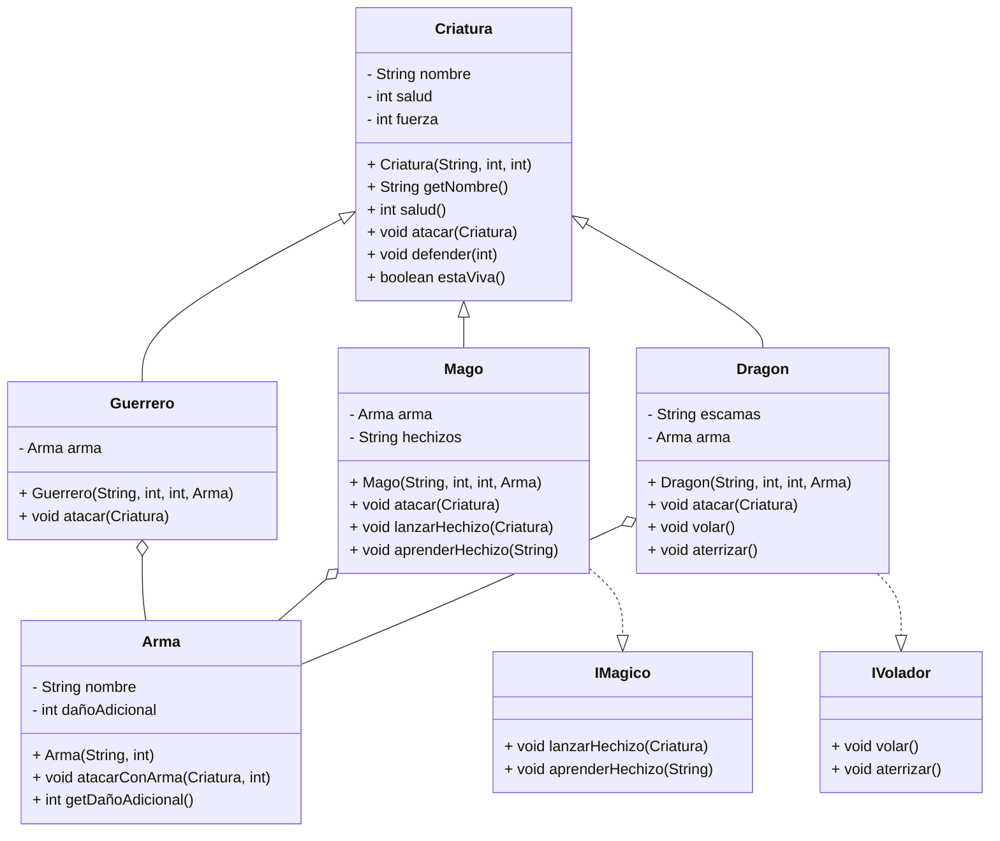

# Explicación de las Clases del Proyecto

## Clase `Main`
Esta clase contiene el método principal del programa y la lógica para simular una batalla entre dos criaturas. Utiliza el método `simularBatalla` para gestionar los turnos y determinar el ganador.

## Clase Abstracta `Criatura`
Define las propiedades y comportamientos básicos de una criatura, como su nombre, salud y fuerza. También incluye métodos para atacar, defender y verificar si la criatura está viva. Es la clase base para las demás criaturas.

## Clase `Guerrero`
Extiende la clase `Criatura` y representa a un guerrero. Utiliza un arma para atacar, lo que le permite infligir daño adicional a sus oponentes.

## Clase `Mago`
Extiende la clase `Criatura` e implementa la interfaz `IMagico`. Representa a un mago que puede lanzar hechizos y aprender nuevos. También utiliza un arma para atacar.

## Clase `Dragon`
Extiende la clase `Criatura` e implementa la interfaz `IVolador`. Representa a un dragón que puede volar y aterrizar. También utiliza un arma para atacar y tiene escamas de un color específico.

## Clase `Arma`
Define un arma con un nombre y un daño adicional. Proporciona el método `atacarConArma` para infligir daño a una criatura combinando la fuerza base y el daño adicional del arma.

## Interfaz `IMagico`
Define los métodos que deben implementar las clases mágicas, como lanzar hechizos y aprender nuevos.

## Interfaz `IVolador`
Define los métodos que deben implementar las clases voladoras, como volar y aterrizar.

## Diagrama de Clases

